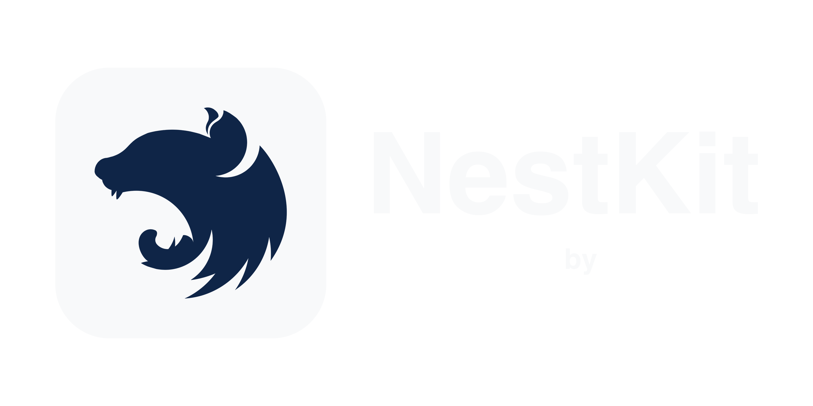

<p align="center">
    <picture>
        <source media="(prefers-color-scheme: dark)" srcset="docs/images/logo/dark.png">
        <source media="(prefers-color-scheme: light)" srcset="docs/images/logo/light.png">
        
    </picture>
</p>

<p align="center">
    A collection of ready-to-use modules and utilities to build NestJS applications faster 🚀
</p>

## Usage

### Build

To build all packages, run the following command:

```bash
npm run build
```

### Publish

We use [changesets](https://github.com/changesets/changesets) to take care of versioning and publishing.

To publish a new release of any or more packages, all you need to do is run the following command and follow the instructions:

```bash
npm run release
```

This will create a changeset that you need to push to GitHub. A release PR will be created, which should publish the package(s) to npm when being merged.

## Contributing

Pull requests are welcome. For major changes, please open an issue first
to discuss what you would like to change.

Please make sure to update tests as appropriate.

## License

[ISC](LICENSE.md)
